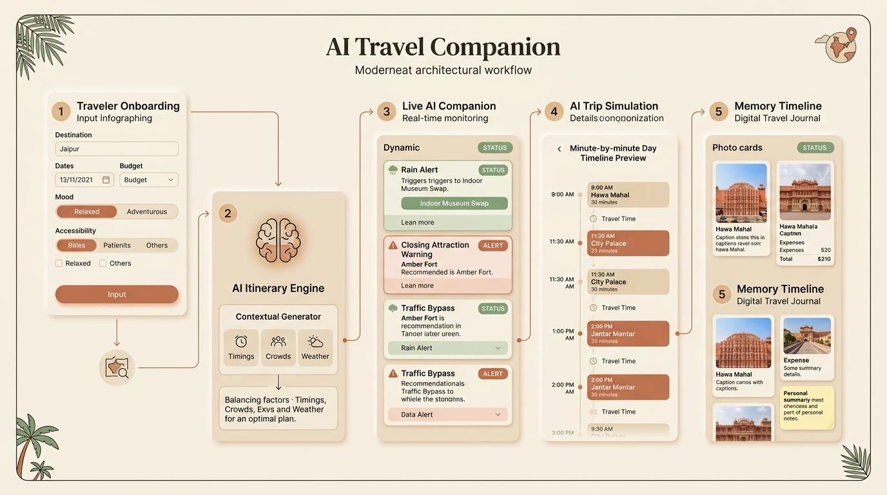
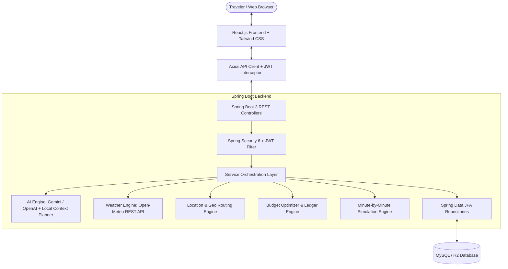

# 🧭 AI Travel Companion

<p align="center">
  
</p>

<p align="center">
  <strong>A live, intelligent travel assistant that plans, adapts, and reacts with you in real time — not just before the trip, but during every minute of it.</strong>
</p>

<p align="center">
  
  
  
  
  
  
</p>

---

## 📖 Table of Contents

- [The Problem vs. The Solution](#-the-problem-vs-the-solution)
- [Design Philosophy & Earthy Palette (No Blue / Purple SaaS Theme)](#-design-philosophy--earthy-palette)
- [Key Features](#-key-features)
  - [1. ★ Live AI Travel Companion (Flagship)](#1--live-ai-travel-companion-flagship)
  - [2. AI Trip Simulation (Signature)](#2-ai-trip-simulation-signature)
  - [3. Mood-Based Trip Planning](#3-mood-based-trip-planning)
  - [4. AI Budget Optimizer](#4-ai-budget-optimizer)
  - [5. Hidden Gems Discovery](#5-hidden-gems-discovery)
  - [6. Crowd Prediction](#6-crowd-prediction)
  - [7. Travel Together Planner](#7-travel-together-planner)
  - [8. Accessibility Mode](#8-accessibility-mode)
  - [9. AI Safety Score & Emergency Dispatch](#9-ai-safety-score--emergency-dispatch)
  - [10. Smart Weather Packing List](#10-smart-weather-packing-list)
  - [11. Memory Timeline & Travel Journal](#11-memory-timeline--travel-journal)
- [System Architecture](#-system-architecture)
- [Prerequisites](#-prerequisites)
- [Step-by-Step Setup & Running Locally](#-step-by-step-setup--running-locally)
- [3-Minute Demo Walkthrough (For Hackathon Judges)](#-3-minute-demo-walkthrough-for-hackathon-judges)
- [REST API Reference](#-rest-api-reference)
- [Environment Variables](#-environment-variables)
- [Database Schema](#-database-schema)

---

## ⚡ The Problem vs. The Solution

| Traditional Travel Apps (Static Checklists) | AI Travel Companion (Live Intelligence) |
|---|---|
| **Stops working once trip starts**: Static PDF or checklist prepared once before arrival. | **Thinks with you in the moment**: Monitors the clock, weather, wallet, and transit conditions. |
| **No weather reactivity**: Still tells you to visit the open-air park during a rainstorm. | **Instant detours**: *"It's raining near Hawa Mahal. Swapping for Albert Hall Museum galleries nearby."* |
| **Ignores operational hours**: Leaves you stranded at closed monument gates. | **Proactive alerts**: *"City Palace ticket counters close in 45 min. Recommend visiting now."* |
| **Traffic blindness**: Lets you sit in traffic jams. | **Route optimization**: *"Heavy congestion on MI Road. Jaipur Pink Metro Line 1 saves 22 mins."* |
| **No budget protection**: You run out of money unexpectedly on day 2. | **Automatic rebalancing**: *"You have ₹800 remaining today. Here are curated cheaper local alternatives."* |

---

## 🎨 Design Philosophy & Earthy Palette

> **"A calm personal travel companion — NOT a complicated enterprise dashboard."**

In strict adherence to design requirements, this application **strictly avoids generic blue, purple, violet, indigo, or neon SaaS themes**. The interface is styled with a **warm, earthy, travel-inspired palette** reminiscent of aged paper, natural sandstone, and terracotta courtyards:

* **Canvas & Surface**: Warm Ivory (`#FAF8F5`, `#FFFDFB`) & Sand (`#F4EFEA`, `#EBDDCF`)
* **Primary Branding**: Terracotta (`#C85A32`, `#B04722`) & Muted Coral (`#DE7858`)
* **Nature Highlights**: Sage Green (`#688464`, `#516B4D`)
* **Text & Typography**: Warm Charcoal (`#292524`), Soft Earth Grey (`#57534E`), and serif headings.

---

## 🌟 Key Features

### 1. ★ Live AI Travel Companion (Flagship)
* Real-time situational engine surfacing dynamic recommendation cards.
* Triggered by live atmospheric readings (rain), monument hours (closing soon), traffic congestion, or budget constraints.
* **Traveler Controls**:
  - **Accept Recommendation**: Automatically mutates the active itinerary.
  - **Keep Current (Reject)**: Dismisses the suggestion.
  - **Ask AI Why**: Transparent explanation of why the detour was proposed.
  - **Regenerate**: Instantly synthesizes fresh situational recommendations.

### 2. AI Trip Simulation (Signature)
* **Minute-by-minute day preview**:
  - `08:30 AM` — Leave hotel (breakfast & battery checks)
  - `09:00 AM` — Reach Hawa Mahal (90m duration, early uncrowded courtyard)
  - `10:35 AM` — Shaded 5-minute walk to City Palace
  - `12:15 PM` — Lunch at nearby LMB heritage sweets & thali
  - `01:30 PM` — Visit Jantar Mantar royal observatory
  - `04:00 PM` — Metro return ahead of rush hour
* Interactive play/pause player, scrubber slider, crowd indicator, and cost counter.

### 3. Mood-Based Trip Planning
* Adapts the pacing, type of attractions, and schedule based on how you feel:
  - **Relaxed**: Cafes, shaded parks, slower sightseeing, minimal transit.
  - **Adventure**: Fort hikes, outdoor ridge walks, active pacing.
  - **Romantic**: Sunset terraces, intimate dining, panoramic vantage points.
  - **Photography**: Timed around sunrise and golden hour lighting.
  - **Food Lover**: Centered around historic sweet shops, street kachoris, and local markets.
  - **Family & Solo**: Safe, low-stress, friendly pacing.

### 4. AI Budget Optimizer
* Real-time ledger calculating **Total Budget**, **Planned Expenses**, **Actual Spent**, **Remaining**, and **Projected Costs**.
* If projected costs exceed budget, the AI triggers cost-cutting substitutions (e.g. swapping private chauffeur cabs for Pink Metro smart cards, single entry tickets for Rajasthan tourism composite passes, and fine dining for top-rated authentic havelis).
* Complete category breakdowns: *Hotel*, *Food*, *Transport*, *Tickets*, *Emergency*, *Other*.

### 5. Hidden Gems Discovery
* Looks past crowded guidebooks to surface places locals love:
  - *Panna Meena Ka Kund* (16th-century geometric stepwell)
  - *Anokhi Museum of Hand Printing* (Restored artisan haveli)
  - *Gaitore Ki Chhatriyan* (Serene white marble cenotaphs)
  - *Padao Sunset Point at Nahargarh* (Panoramic hill ridge)
* Filter by travel mood with one-click **"Add to Itinerary"**.

### 6. Crowd Prediction
* Hourly breakdown of attraction volume categorized into **Quiet**, **Moderate**, and **Crowded** windows.
* Specifies the **"Best Time to Visit"** and estimated queue wait minutes. Clearly distinguishes estimated data from live sensors.

### 7. Travel Together Planner
* Built for friend groups who can never agree on a plan:
  1. Create group and generate unique invite code (`GRP-XXXXXX`).
  2. Each traveler votes for favorite places, activities, and budget caps.
  3. AI synthesizes all votes into an optimal compromise itinerary.
  4. Automatic expense division calculates the exact split per person.

### 8. Accessibility Mode
* First-class preference routing tailored for:
  - **Wheelchair Users**: Ramp-equipped entrances, step-free corridors, and elevators.
  - **Senior Citizens**: Gentle walking distances, frequent benches, and vehicle drop-offs.
  - **Families with Strollers**: Wide pedestrian verandas and shaded rest zones.

### 9. AI Safety Score & Emergency Dispatch
* Geofenced safety ratings based on street lighting, verified police presence, and tourist footfall.
* One-tap direct dial links:
  - **National Emergency**: `112`
  - **Police Helpline**: `100`
  - **Medical Ambulance**: `102`
  - **Women Safety**: `1091`
  - **Tourist Helpline**: `1363`
* Lists nearest police stations and trauma hospitals with live distances and contacts.

### 10. Smart Weather Packing List
* Personalized checklist auto-generated from destination forecast, duration, and planned activities.
* Grouped under *Clothing*, *Documents*, *Electronics*, *Health*, and *Gear*.
* Check/uncheck persistence, custom item additions, and one-click regeneration.

### 11. Memory Timeline & Travel Journal
* Digital travel diary created during or after the trip.
* Upload photos, log visited places, record expenses, write reflections, and tag emotions (*Joyful*, *Peaceful*, *Adventurous*, *Delicious*).

---

## 🏗️ System Architecture



---

## 💻 Prerequisites

- **Java**: OpenJDK 21 LTS (`java -version`)
- **Maven**: Apache Maven 3.9+ (`mvn -version`)
- **Node.js**: v18+ (tested on Node v24 LTS, `node -version`)
- **MySQL**: 8.0+ *(Optional: The application automatically starts with zero-setup H2 MySQL-compatibility mode if MySQL is not configured)*

---

## 🚀 Step-by-Step Setup & Running Locally

### 1. Clone the Repository
```bash
git clone https://github.com/26fatimasiddiqui-create/ai_travel_companion.git
cd ai_travel_companion
```

### 2. Run the Spring Boot Backend (Port 8080)
```powershell
cd backend
$env:SPRING_PROFILES_ACTIVE="h2"
mvn spring-boot:run
```
> *The backend initializes on `http://localhost:8080`. It automatically seeds the Jaipur demo trip, demo user (`demo@travelcompanion.ai` / `password123`), hotels, and hidden gems on startup.*

### 3. Run the React Frontend (Port 5173)
```powershell
cd ../frontend
npm install
npm run dev
```
> *Open **`http://localhost:5173`** in your browser!*

---

## ⏱️ 3-Minute Demo Walkthrough (For Hackathon Judges)

1. **Landing Page (`http://localhost:5173`)**:
   - Notice the warm earthy aesthetic (**Terracotta + Sand + Sage + Ivory**), with zero blue/purple SaaS branding.
   - Click **"Explore Jaipur Demo"** for instant 1-click authentication.
2. **Dashboard (`/dashboard`)**:
   - **Greeting**: *"Good morning, ready for Jaipur?"*
   - **Flagship Live AI Companion Card**: Examine situational alerts (*Rain approaching, Attraction closing soon, Traffic on MI Road*). Click **"Ask AI Why"** to see transparent reasoning, then click **"Accept Recommendation"** to watch the itinerary dynamically update!
   - **Sequenced Itinerary**: View scheduled stops with time slots, crowd ratings, costs, and completion checkmarks.
   - **AI Budget Optimizer**: Review the ledger (₹5,000 budget, spent, remaining, projected). Click **"Log Expense"** to add an entry.
   - **Interactive Route Map**: View numbered terracotta pins and dotted route path.
   - **Weather, Crowd, Safety & Packing List**: Real-time atmospheric signals, safety dispatch, and weather-triggered packing checklist.
3. **Trip Simulation (`/simulation`)**:
   - Click **"Play Simulation"** to watch the entire day previewed minute-by-minute (`8:30 AM` hotel departure ➔ `9:00 AM` Hawa Mahal ➔ `10:35 AM` City Palace ➔ `12:15 PM` lunch ➔ `4:00 PM` return).
4. **Hidden Gems (`/hidden-gems`)**:
   - Filter by *Relaxed*, *Photography*, or *Romantic* to discover Panna Meena Stepwell and Anokhi Museum. Click **"Add to Itinerary"**.
5. **Travel Together Planner (`/group-planner`)**:
   - Review the group invite code, submit traveler preferences, and view the AI compromise consensus and per-person cost split.
6. **Memory Timeline (`/memories`)**:
   - Review digital travel journal cards with photo memories, reflections, and emotional tags.

---

## 📡 REST API Reference

| Method | Endpoint | Description |
|---|---|---|
| `POST` | `/api/auth/register` | Register new user |
| `POST` | `/api/auth/login` | Authenticate & receive JWT |
| `GET` | `/api/auth/me` | Current authenticated traveler |
| `GET` | `/api/trips` | List user trips |
| `POST` | `/api/trips` | Create trip with mood & accessibility profile |
| `POST` | `/api/trips/{id}/generate-itinerary` | Generate AI itinerary |
| `GET` | `/api/trips/{id}/itinerary` | Get sequenced day-wise itinerary |
| `PATCH`| `/api/trips/itinerary/{itemId}/toggle` | Toggle stop completion |
| `GET` | `/api/trips/{id}/companion/alerts` | Get live situational alerts |
| `POST` | `/api/companion/alerts/{id}/accept` | Accept companion recommendation |
| `POST` | `/api/companion/alerts/{id}/reject` | Dismiss companion recommendation |
| `GET` | `/api/companion/alerts/{id}/why` | AI reasoning behind alert |
| `GET` | `/api/trips/{id}/budget/summary` | Financial ledger & optimization recommendations |
| `POST` | `/api/trips/{id}/expenses` | Log trip expense |
| `GET` | `/api/trips/{id}/simulation` | Minute-by-minute day simulation |
| `GET` | `/api/places/hidden-gems` | Curated hidden gems filtered by mood |
| `GET` | `/api/places/crowds` | Quiet & peak visiting windows |
| `GET` | `/api/places/safety` | Safety scores & emergency contacts |
| `GET` | `/api/weather` | Live atmospheric conditions & advice |
| `GET` | `/api/trips/{id}/group` | Collaborative group trip details |
| `POST` | `/api/groups/{id}/vote` | Submit group preference vote |
| `GET` | `/api/trips/{id}/packing-list` | Dynamic packing checklist |
| `POST` | `/api/trips/{id}/memories` | Add photo memory to travel journal |

---

## ⚙️ Environment Variables (`.env.example`)

```env
# Backend Configuration
SERVER_PORT=8080
SPRING_PROFILES_ACTIVE=h2 # or 'default' for MySQL

# MySQL Credentials (When active)
DB_URL=jdbc:mysql://localhost:3306/travel_companion?createDatabaseIfNotExist=true&useSSL=false&allowPublicKeyRetrieval=true&serverTimezone=UTC
DB_USERNAME=root
DB_PASSWORD=root

# Security
JWT_SECRET=404E635266556A586E3272357538782F413F4428472B4B6250645367566B5970
JWT_EXPIRATION_MS=86400000

# AI & Spatial Integrations (Optional: Local AI & Leaflet engines run automatically)
GEMINI_API_KEY=your_gemini_api_key_here
GOOGLE_MAPS_API_KEY=your_google_maps_key_here
WEATHER_API_KEY=your_weather_key_here
```

---

## 🗄️ Database Schema

The database features 12 relational JPA entities:
* `users` — Authentication credentials, full name, role, and travel preferences.
* `trips` — Destination, dates, budget, travelers count, travel type, mood, and accessibility profile.
* `itinerary_items` — Sequenced activities, timings, travel buffers, costs, crowd tags, weather notes, and accessibility features.
* `expenses` — Ledger entries categorized by Hotel, Food, Transport, Tickets, Emergency, and Other.
* `places` — Coordinates, quiet/peak hours, descriptions, and safety scores.
* `hotels` — Accommodation options, ratings, prices, and accessibility flags.
* `reviews` — Traveler ratings and community feedback.
* `memories` — Photos, reflection notes, visit dates, and emotional tags.
* `group_trips` — Collaboration invite codes and AI compromise consensus.
* `group_votes` — Traveler preferences, must-see places, and individual budget caps.
* `packing_items` — Smart checklist items with weather triggers.
* `companion_alerts` — Active situational alerts with status (`PENDING`, `ACCEPTED`, `REJECTED`).

---

## 📜 License
Created for Mini Project 5th Sem & AI Hackathon.
All rights reserved © 2026.